# Agentic AI System

## 🏆 Achievements
- **Second Prize** at the *Artificial Intelligence Competition 2025*  
  Organized by the Faculty of Information Technology, NTT University.  
  [🔗 Official News](https://cntt.ntt.edu.vn/hoat-dong/sinh-vien/cuoc-thi-tri-tue-nhan-tao-khoa-cong-nghe-thong-tin-2025-khoi-nguon-sang-tao-ket-noi-tri-thuc/?fbclid=IwY2xjawMWnptleHRuA2FlbQIxMABicmlkETFLaVRvc0VRb1dZbU5UdGg2AR6x5ZYqVlhCeQ3qpbNIsjpz5ygtloT4PjspwOqKnDNimhtJ9Rt1H0wEO-BFCA_aem_Jn8JBO13SCZCAkhb7maEeg)

## Chatbot UI
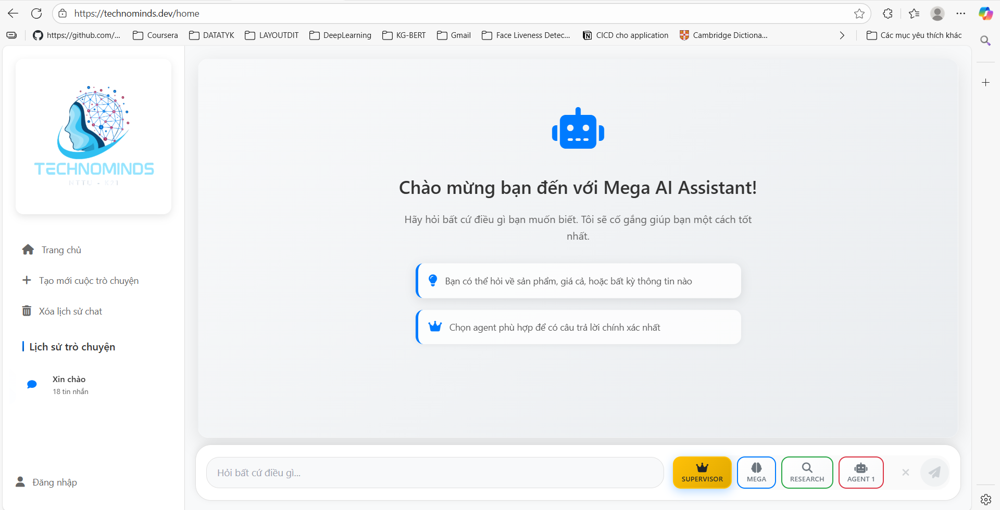
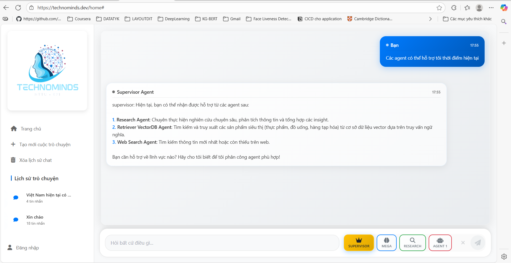
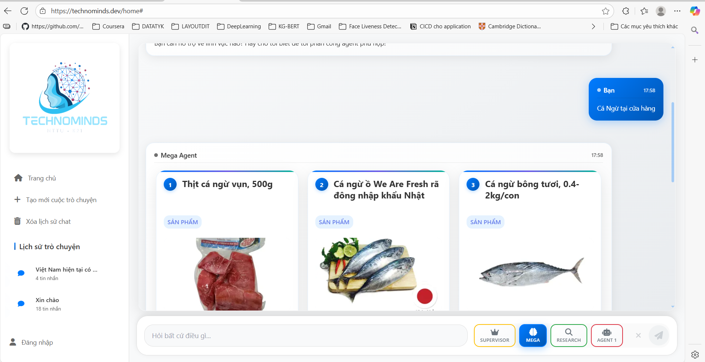
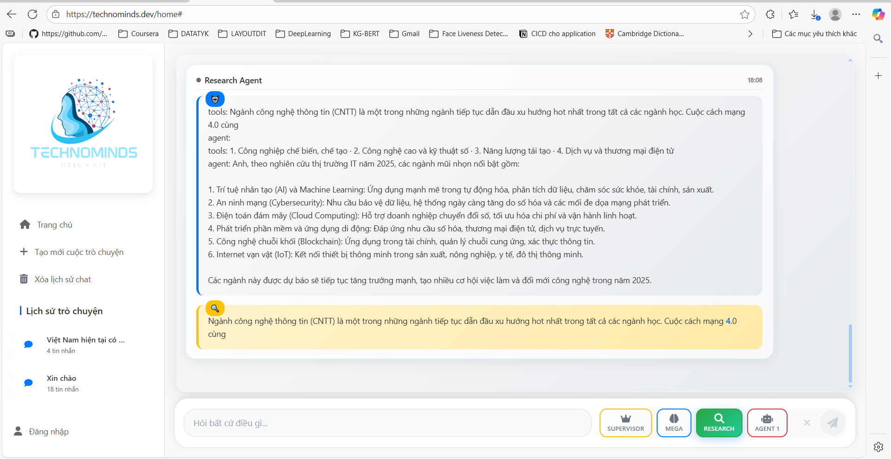
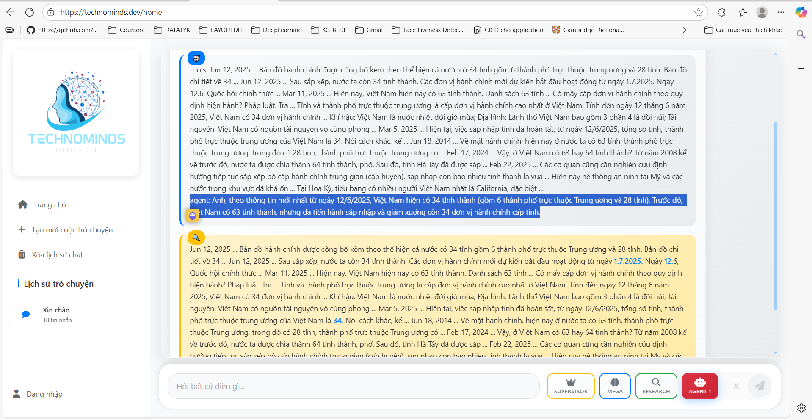

## API Chatbot
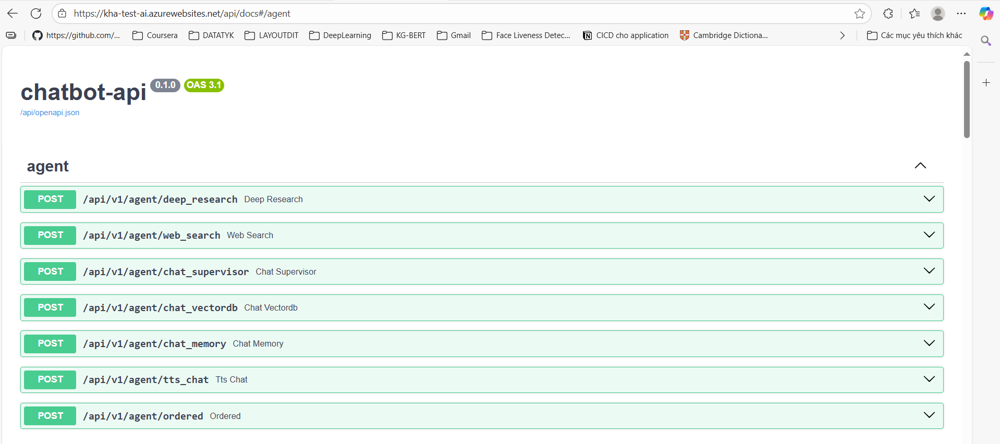
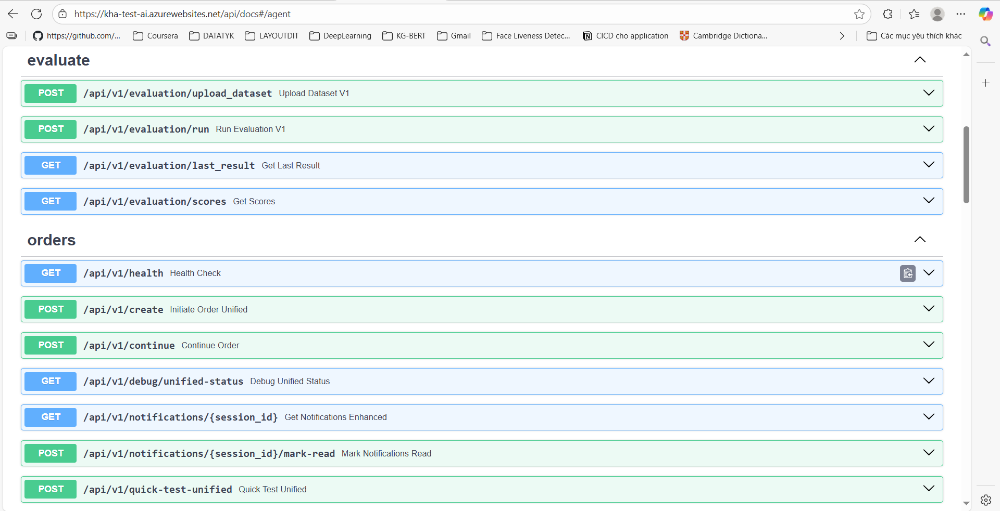
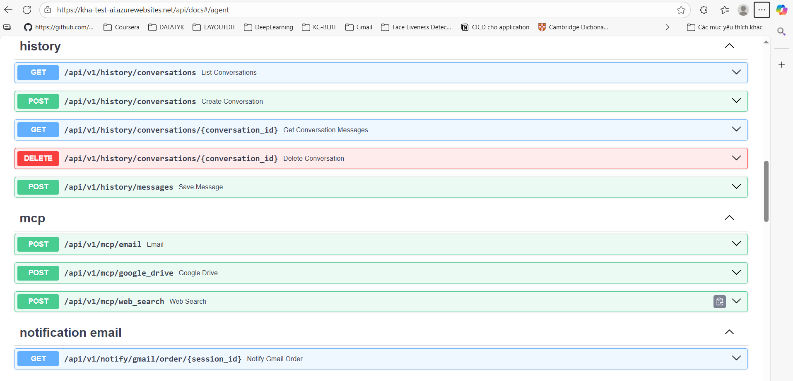
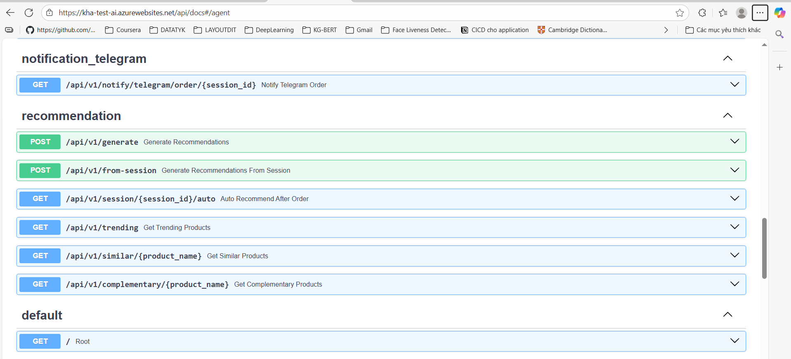

# AI-Powered Data Pipeline and Chatbot System

## System Overview

This project consists of two main components:
1. Data Pipeline Architecture
2. AI Chatbot Architecture

Both systems are containerized using Docker for easy deployment and scalability.

## Data Pipeline Architecture

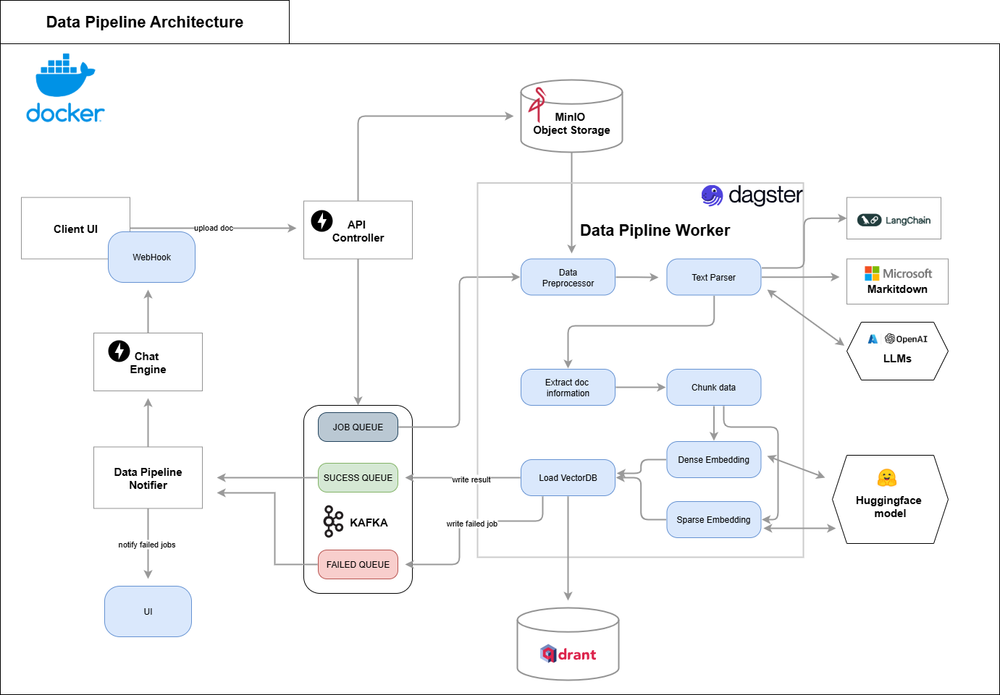

### Components

- **Client UI**: Frontend interface with WebHook integration
- **API Controller**: Handles incoming requests and orchestrates data flow
- **MinIO**: Object storage for raw data
- **Data Pipeline Worker**: Main processing unit including:
  - Data Preprocessor
  - Text Parser
  - Extract Doc Information
  - Dense/Sparse Embedding generators
- **Integration with AI Services**:
  - LangChain
  - Microsoft Markitdown
  - OpenAI LLMs
  - Huggingface models
- **Message Queue System**: Kafka-based with:
  - SUCCESS QUEUE
  - FAILED QUEUE
  - JOB QUEUE
- **Vector Storage**: Qdrant for vector data storage

### Data Flow

1. Data enters through Client UI or WebHook
2. API Controller processes and routes requests
3. Data is stored in MinIO
4. Pipeline Worker processes documents through various stages
5. Results are stored in vector database
6. Status updates are managed through Kafka queues

### Dagster Pipeline
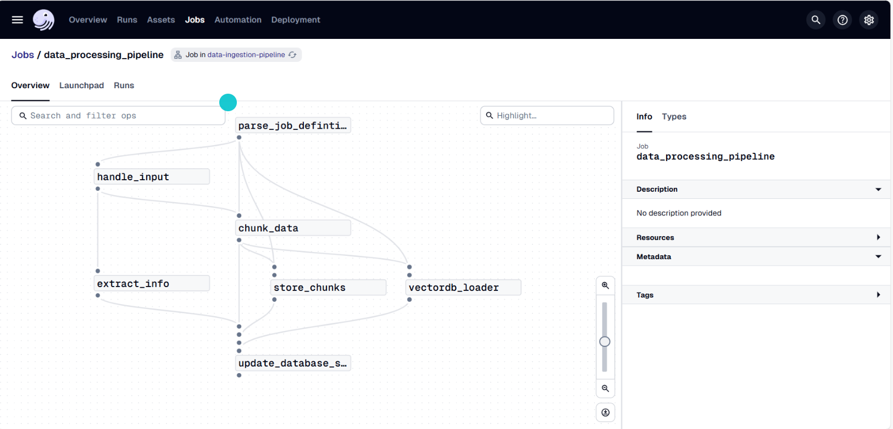

### Job Trigger
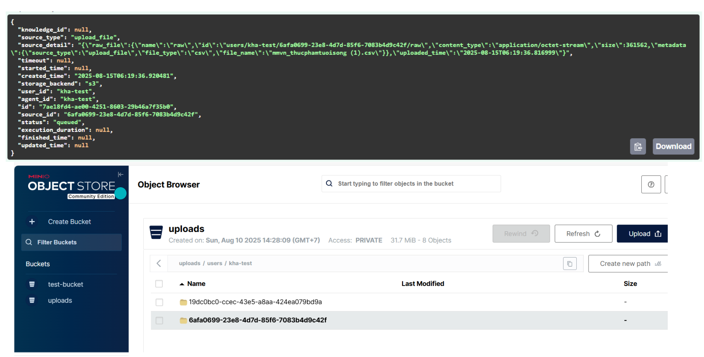

## AI Chatbot Architecture
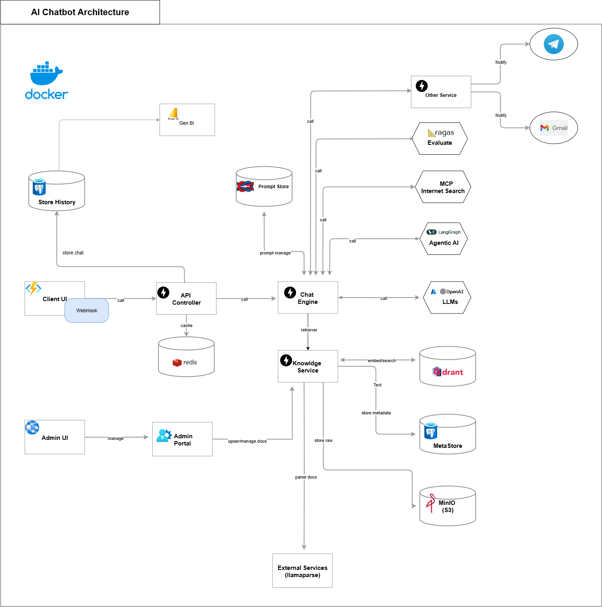
### Components

- **Client UI**: Web-based interface
- **API Controller**: Request handling and routing
- **Chat Engine**: Core conversational processing
- **Knowledge Service**: Information management
- **Storage Systems**:
  - Store History: Chat history storage
  - MetaStore: Metadata management
  - MinIO: Object storage
- **External Services**:
  - Telegram integration
  - Gmail integration
  - Internet Search (BCP)
  - LangChain Agents AI
  - OpenAI LLMs

### Embedding Model Finetune
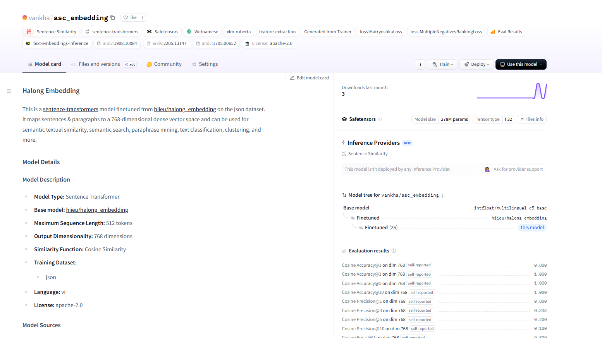

### Features

- Multi-channel support (Telegram, Gmail)
- Admin Portal for system management
- Integrated knowledge base
- Real-time chat capabilities
- External service integrations

## Technical Stack

- **Containerization**: Docker
- **Storage**: MinIO, Qdrant, Redis
- **Message Queue**: Kafka
- **AI/ML**: OpenAI, Huggingface, LangChain
- **External APIs**: Telegram, Gmail

## Requirements

- Docker and Docker Compose
- MinIO credentials
- API keys for external services
- Sufficient storage and computing resources

## License

This project is private and not publicly distributed.

All source code and model details are owned by the author.
